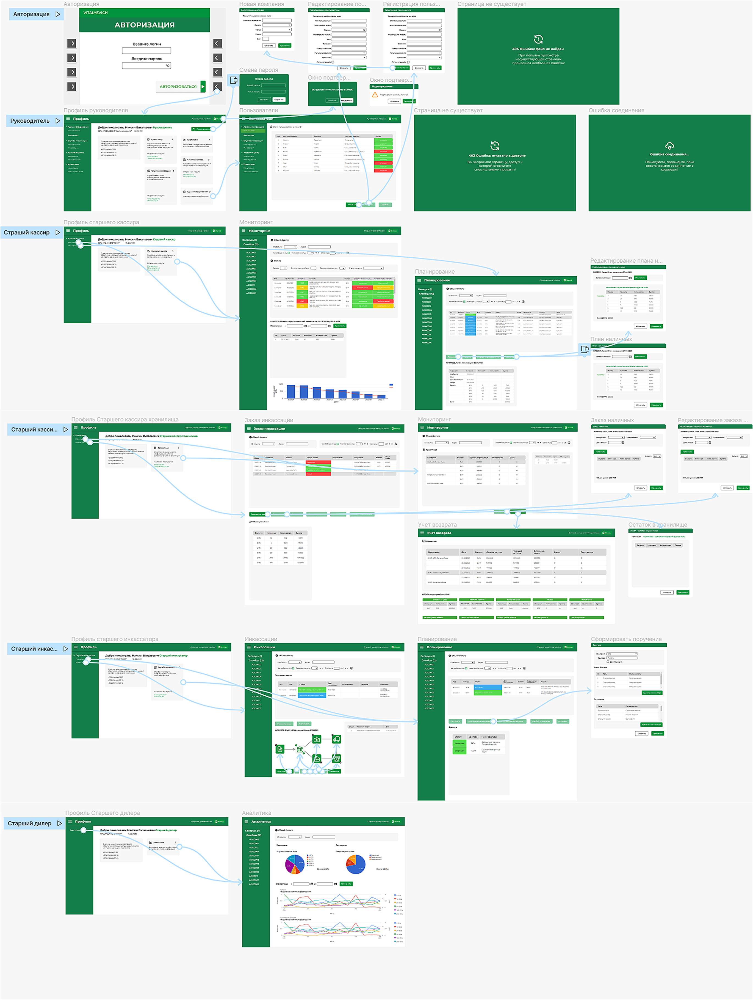

## A SOFTWARE TOOL FOR MONITORING AND ANALYZING CASH FLOWS IN THE BANK'S SELF-SERVICE DEVICE NETWORK

## Cash-Management ATM

## Technology stack
- Spring Boot 2.7.10
- Spring Security
- Spring MVC
- Spring Data
- JS
- HTML 5
- CSS
- GraphQL
- JSON Web Token
- Thymeleaf
- Firebase
- Docker
- GitHub Actions

### Screenshots

